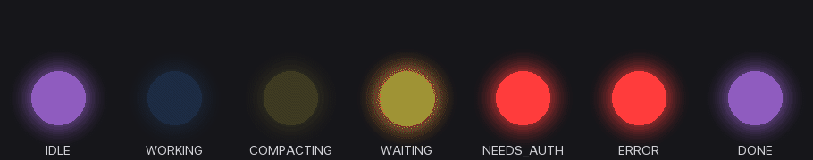

# VibeLight

> Project your AI agent's vibe onto a real lamp.

VibeLight is a macOS menu-bar app that watches what Claude Code is doing in your terminal and drives a Home Assistant–controlled light in real time. Glance at the lamp, know whether the agent is thinking, waiting for you, or done — without alt-tabbing into the terminal.

It's the smallest possible bridge between "agent state in the CLI" and "physical signal in the room."



---

## Why

Coding with an AI agent now means juggling multiple sessions: one is grinding through a refactor, another paused for your approval, a third silently finished ten minutes ago. The terminal is a noisy place to check on all of them.

A lamp is not. Purple = idle. Blue breathing = working. Orange flashing = the agent needs you. You don't have to look at it — you'll notice when it changes.

---

## What it does

VibeLight runs a tiny local HTTP broker (`127.0.0.1:17345`) that Claude Code's hooks POST to on every event. The broker maintains a per-session state machine, arbitrates across all active sessions, and pushes the **effective state** to your light through Home Assistant.

### State model

| State | Color | Effect | When |
|---|---|---|---|
| **IDLE** | purple | solid | no active session |
| **WORKING** | blue | breathe | thinking / tool calls in flight |
| **COMPACTING** | yellow | breathe | Claude Code is compacting context |
| **WAITING_INPUT** | orange | blink 3 s → solid | a `Notification` hook fired (agent is waiting on you) |
| **NEEDS_AUTH** | red | solid | agent asked for tool-use permission |
| **ERROR** | red | blink 1 Hz, auto-clears after 5 s | a tool call errored |
| **DONE** | purple | blink 2 s → IDLE | agent finished a turn |

Higher-priority states beat lower-priority ones when multiple sessions are active (e.g. one session WORKING + another NEEDS_AUTH → light goes red). All colors and effects are user-tunable from the Light Effects settings page.

### Two driver modes

1. **Broker-Emulated (default)** — VibeLight calls `light.turn_on` over HA REST directly, simulating breathe/blink with rapid REST calls. Works out of the box, no HA configuration needed beyond a long-lived token. Best for getting started.
2. **Scene Pack (opt-in)** — VibeLight installs seven HA scenes (`scene.vibelight_idle`, `…_working`, etc.) and calls `scene.turn_on`. Less REST chatter, easier to customize per-light in HA. Recommended once you're happy with your colors.

### Other niceties

- **Cold-start session recovery** — at launch, VibeLight scans `~/.claude/projects/*/*.jsonl` (filenames only, no transcript parsing) and seeds the session store with the last 24 h of sessions so the menu's Sessions list isn't empty when you start the app fresh.
- **At-home detection** — uses `NWPathMonitor` + periodic HA `/api/` probes. When you're off your home network the light isn't reachable, so VibeLight pauses driving instead of spamming failed REST calls. Status is visible in the menu.
- **Pause** — pause 15 min / 1 h / until tomorrow / indefinitely from the menubar. Useful when you don't want the lamp blinking through a meeting.
- **Test render** — pick a state from the menu to drive the light to that state on demand. Great for picking colors.
- **Onboarding wizard** — first launch walks you through HA URL (mDNS LAN scan included), token, light entity, hook installation, network confirmation, and a guided light test.
- **Launch at login** — toggled via `SMAppService`. Unsigned dev builds will show a warning (see Open tasks).

---

## Install

### Prerequisites

- macOS 13 Ventura or newer
- A Home Assistant instance reachable on your LAN
- A long-lived HA access token (Profile → Long-Lived Access Tokens)
- A light entity that supports `rgb_color` + `brightness` (Hue, WiZ, ESPHome, Tasmota, etc.)
- Xcode 15 / Swift 5.9 toolchain (for building from source)

### Build from source

```bash
git clone git@github.com:ryekee/VibeLight.git
cd VibeLight
./scripts/bundle.sh         # builds and produces build/VibeLight.app
open build/VibeLight.app
```

The first launch shows the onboarding wizard. Follow it through and you'll be done.

### Headless mode (CLI)

If you don't want the menubar app, the same broker ships as a CLI:

```bash
swift build -c release
.build/release/vibelight-broker --config ./config.json
```

Use `Resources/config.example.json` as a starting point.

---

## Use

Once running, the menubar shows a colored circle reflecting the effective state. Click it for:

- **Sessions** — list of active Claude Code sessions, their current per-session state, and the last event time.
- **Test render** — force the light to any of the 7 states.
- **Pause** — pause for 15 min, 1 h, until tomorrow, or indefinitely.
- **Settings** — open the settings window (NavigationSplitView sidebar):
  - **General** — launch at login, default pause duration.
  - **Integrations** — HA URL/scan/token, light entity picker, connection test, Claude Code hook install/uninstall.
  - **Light Effects** — per-state color picker, brightness slider, effect dropdown, grouped into Session / Interactions / System.
  - **Network** — at-home / away status, SSID hint, manual probe button.
  - **Scene Pack** — switch between Broker-Emulated and Scene Pack driver, install/uninstall the seven HA scenes.
  - **Diagnostics** — broker port, open logs, reset all settings.
  - **About** — version, source link, license.
- **Quit**.

To send a test event by hand:

```bash
curl -X POST 'http://127.0.0.1:17345/event?hook=UserPromptSubmit' \
  -H 'Content-Type: application/json' \
  --data '{"session_id":"abc123","cwd":"/tmp"}'
```

---

## Architecture

```
┌──────────────────┐                   ┌────────────────────────┐
│ Claude Code      │                   │ VibeLight.app          │
│ (hooks)          │ ───POST /event──► │ • HTTP broker          │     ┌─────┐
└──────────────────┘                   │ • SessionStore + Arb.  │ ──► │ HA  │ ──► 💡
┌──────────────────┐                   │ • LightDriver          │ REST└─────┘
│ Claude Code      │ ───POST /event──► │ • HomeReachability     │
│ (hooks)          │                   │ • Menu bar + Settings  │
└──────────────────┘                   └────────────────────────┘
```

**Swift Package targets:**

| Target | Purpose |
|---|---|
| `VibeBrokerCore` | Pure state model, session arbitration, config — no I/O. |
| `VibeBrokerNet`  | HTTP listener (`NWListener`), HA client, mDNS browser, `HomeReachability`, `TranscriptDiscovery`, `BrokerHost` orchestrator. |
| `vibelight-broker` | Headless CLI binary. |
| `vibelight-app`  | SwiftUI menu-bar app, onboarding, settings, keychain. |

**Tests:** 81 tests across `VibeBrokerCoreTests` and `VibeBrokerNetTests`. Run with `swift test`.

The deeper design doc lives at [`docs/superpowers/specs/2026-05-27-vibelight-design.md`](docs/superpowers/specs/2026-05-27-vibelight-design.md). Per-milestone implementation plans are in [`docs/superpowers/plans/`](docs/superpowers/plans/).

---

## Hook integration

VibeLight installs a shell shim at `~/.claude/hooks/vibelight.sh` that POSTs every hook payload to the local broker, with a 200 ms timeout and silent failure (the script must never block Claude Code). The shim is registered under all eight hook events: `SessionStart`, `UserPromptSubmit`, `PreToolUse`, `PostToolUse`, `Notification`, `PreCompact`, `Stop`, `SessionEnd`.

Install / uninstall is a one-click button in Settings → Integrations. If you'd rather wire it yourself, the script is at [`Resources/vibelight.sh`](Resources/vibelight.sh).

---

## Open tasks

Tracked roughly in priority order. This is what's *not yet* done, in case you want to contribute or want to know the rough edges before you try it.

### P5 — Codex support
- [ ] **Codex CLI hook installer** — write `~/.codex/config.toml` with `[features].hooks = true` and register `SessionStart` / `UserPromptSubmit` / `Stop` hooks, symmetric to the Claude Code installer.
- [ ] **Codex Desktop app integration** — spawn `codex app-server` and consume its JSON-RPC stream as a parallel event source (finer-grained than hooks).
- [ ] **Terminal pane jump-back** — capture `TERM_PROGRAM` / pane id in the hook script so the menu can deep-link back to the originating terminal session.

### Polish
- [ ] **Menubar icon animations** — currently a static colored circle. Make the icon itself breathe/blink to mirror the light effect.
- [ ] **Two-poll liveness threshold** — replace the 5-minute session TTL with "no hook event for N successive probes" so transient quiet doesn't drop a session.
- [ ] **About page real GitHub URL** — currently a disabled placeholder; wire it once this repo is public.
- [ ] **Color presets** — the default palette is functional but a bit harsh. Ship 2–3 curated presets (warm, cool, neon) and a "load preset" button on the Light Effects page.
- [ ] **Sessions window deep-link** — clicking a session row in the menu should open a window showing its event log, not just dismiss the menu.

### Production-readiness
- [ ] **Code signing + notarization** — required for `SMAppService` Launch-at-login to work without warnings, and for distribution outside a manual `bundle.sh` build.
- [ ] **DMG / Homebrew Cask distribution** — `bundle.sh` produces a runnable `.app` but there's no signed release artifact.
- [ ] **GitHub Actions CI** — `swift test` + `swift build` matrix; currently tests are run locally only.
- [ ] **Settings export / import** — JSON dump of the full config (sans token) for easy machine migration.

### Stretch
- [ ] **Multi-light support** — drive multiple HA entities (desk strip + ambient lamp) with different colors per state.
- [ ] **Non-HA backends** — abstract `LightDriver` enough to add LIFX LAN, Hue Bridge direct, or Govee LAN as alternatives.
- [ ] **Other agents** — Cursor, Aider, anything that exposes a hook surface.
- [ ] **Web dashboard** — read-only view of session history and state timeline.

---

## Project status

- **Active development.** Built end-to-end via a 4-milestone TDD plan (`P1` broker core → `P2` app shell → `P3` onboarding + settings → `P4` settings refactor + cold-start). Each milestone is tagged in git.
- **Daily-driven** locally against a real Home Assistant + Hue setup. Works.
- **Unsigned dev builds only** today — see Open tasks for the path to a signed release.

---

## License

MIT — see [LICENSE](LICENSE).

---

## Acknowledgements

- Design and execution were paired with Claude Code via the [superpowers](docs/superpowers/) workflow (brainstorming → spec → per-milestone plans → subagent-driven implementation).
- Inspiration drawn from [Octane0411/open-vibe-island](https://github.com/Octane0411/open-vibe-island) for Claude Code / Codex state-detection techniques.
